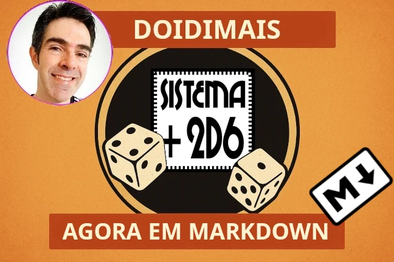

# Sistema +2d6 em Markdown: agora o Tio Nitro fala *plaintext*

Se você é como eu — daqueles que preferem um `.txt` bem limpo a um
`.docx` cheio de tralha de formatação — então essa notícia vai te
agradar: acabei de converter o **Sistema +2d6**, do lendário *Tio
Nitro*, para **Markdown**.

Sim, Markdown. Aquele formato leve, legível, multiplataforma e perfeito
pra quem quer abrir, editar, versionar e publicar regras de RPG sem
ficar refém de softwares corporativos ou de interfaces cheias de
distração. Agora o +2d6 virou um verdadeiro **System Reference
Document**.

## O que é o Sistema +2d6?

Pra quem não conhece, o +2d6 é um sistema de regras genéricas e
customizáveis criado pelo Newton Rocha, mais conhecido como **Tio
Nitro** — uma das figuras mais influentes da cena de RPG brasileira.
Publicado originalmente em 2012 sob **licença Creative Commons**, ele
foi pensado pra mestres e jogadores que curtem liberdade, improviso e
pancadaria narrativa bem resolvida.

## O que eu fiz?

Basicamente:

- Peguei o DOC original do Tio Nitro.
- Corrigi alguns errinhos tipográficos e gramaticais.
- Dei uma padronizada na formatação (ficou tinindo).
- E converti tudo pra **Markdown estruturado**, com metadados
  compatíveis com **Pandoc**.

O resultado é uma **obra derivada**, sim — mas respeitando a licença
original e mantendo o conteúdo 99,9% fiel. Só limpei umas firulas em
tabela pra caber melhor na página.

## Por quê?

Porque **texto plano é rei**. Markdown é portável, versionável (Git
manda um abraço), fácil de converter pra PDF, HTML, LaTeX, DOCX, EPUB e
até pedra tabuinhas de argila em cuneiforme, se alguém programar isso.
Ideal pra quem quer:

- Fazer suas próprias adaptações do +2d6.
- Publicar variantes em sites, blogs, repositórios ou zines.
- Levar o sistema pro mundo digital sem carregar bagagem inútil.

---

Se você curte RPG nacional, valoriza a simplicidade e quer um sistema
pronto pra ser *hackeado*, **o +2d6 em Markdown é pra você**. Agora é só
baixar, clonar ou forkar e partir pro jogo.

---

Publicado originalmente na [GURPZine](https://www.gurpzine.com.br)  
em 23 de Julho de 2025  
por Daniel "Nerun" Rodrigues
